# 13_SEQUENCE_DIAGRAMS.md

# ShareCutter - Sequence Diagrams

## מטרת המסמך

להציג את זרימת הבקשות המרכזיות במערכת בין ה-Frontend, שכבות ה-Backend ומסד הנתונים.

התרשימים נכתבו ב-Mermaid כדי שניתן יהיה להציג אותם ישירות ב-GitHub, ב-VS Code ובכל עורך Markdown תומך.

---

# רכיבים מרכזיים

- Angular Client
- REST Controller
- Service Layer
- Repository Layer
- PostgreSQL
- JWT Security Filter
- Password Encoder
- Mapper
- Transaction Manager

---

# 1. Register User

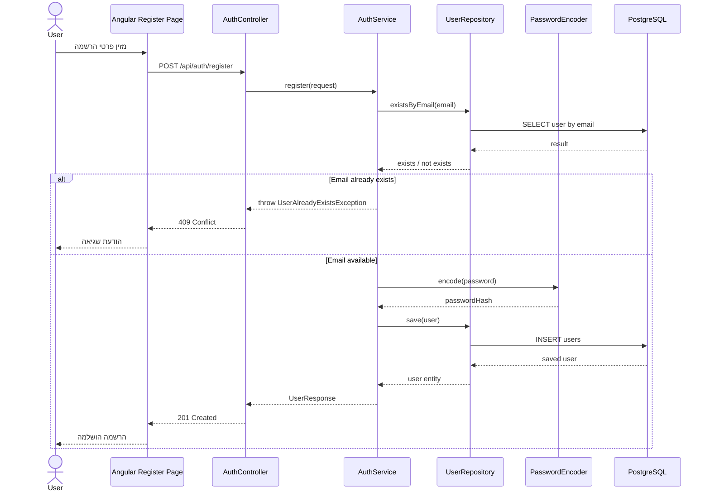

## כללי מימוש

- אימייל מנורמל לפני הבדיקה.
- אין לשמור סיסמה גולמית.
- אין להחזיר passwordHash בתגובה.
- כפילות אימייל מוחזרת כ-409.

---

# 2. Login

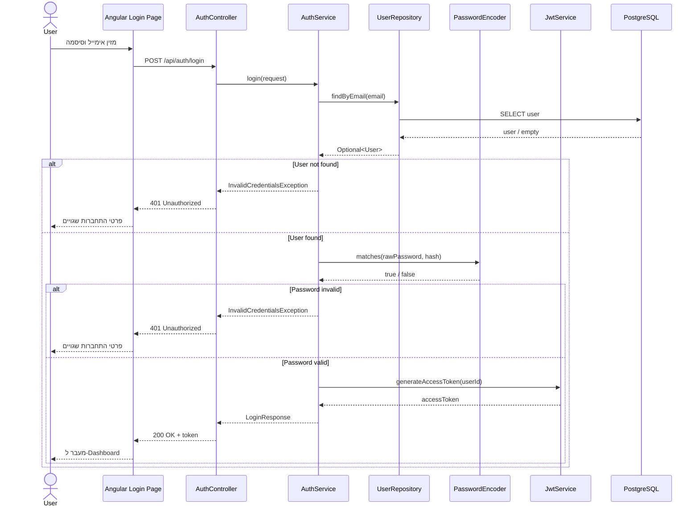

## כללי מימוש

- אותה הודעת שגיאה עבור אימייל או סיסמה שגויים.
- אין לחשוף אם משתמש קיים.
- ה-JWT כולל מזהה משתמש בלבד ומידע מינימלי.

---

# 3. Load Current User

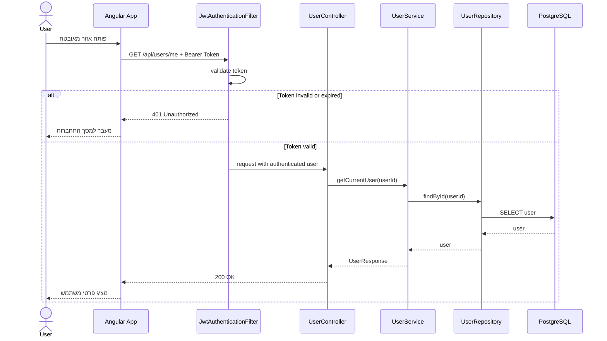

---

# 4. Create Portfolio by Investment Amount

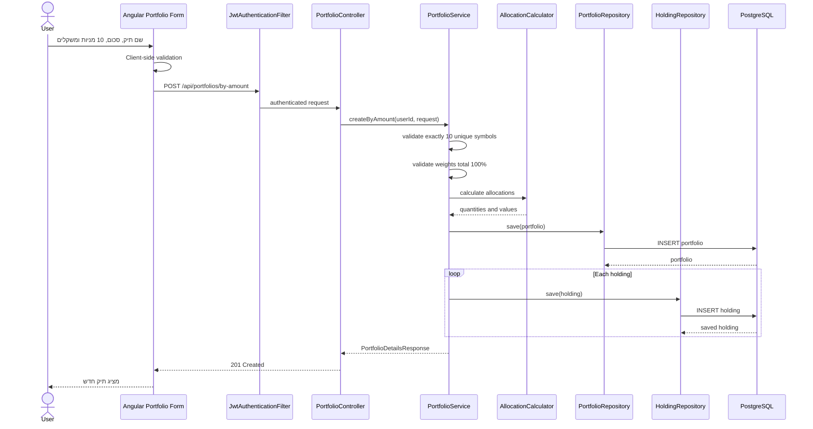

## Transaction Boundary

כל הפעולה חייבת לרוץ בתוך `@Transactional`.

אם יצירת Holding אחת נכשלת, כל יצירת התיק מתבטלת.

---

# 5. Create Portfolio from Existing Holdings

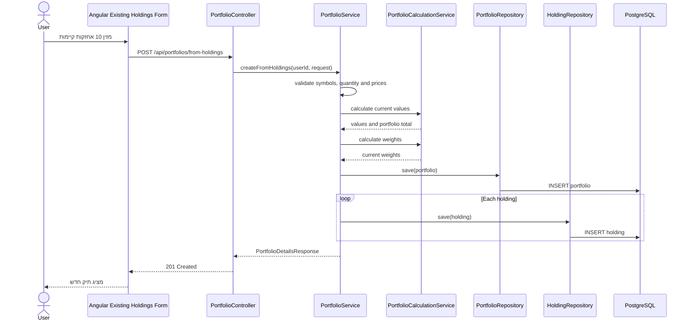

---

# 6. Create Weekly Signal

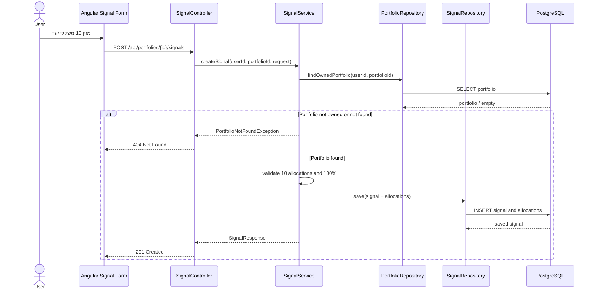

---

# 7. Preview Rebalance

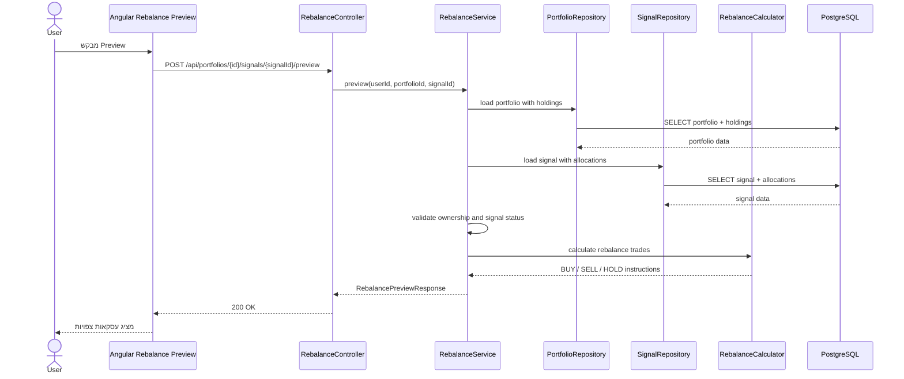

## חשוב

Preview אינו משנה מידע במסד הנתונים.

הוא מבצע חישוב בלבד.

---

# 8. Execute Rebalance

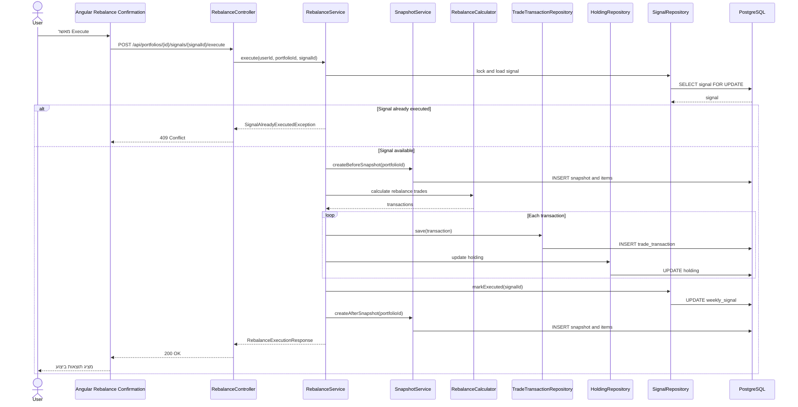

## Transaction Boundary

הפעולה כולה רצה בתוך Transaction אחת:

1. נעילת Signal.
2. Snapshot לפני.
3. יצירת Transactions.
4. עדכון Holdings.
5. סימון Signal כבוצע.
6. Snapshot אחרי.

כל כשל גורם ל-Rollback מלא.

---

# 9. Load Dashboard

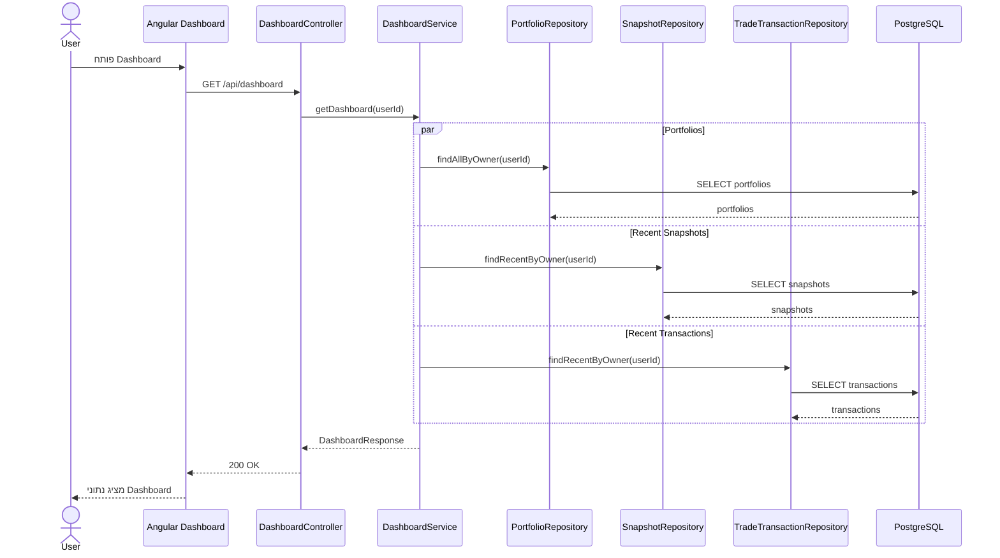

---

# 10. Ownership Validation

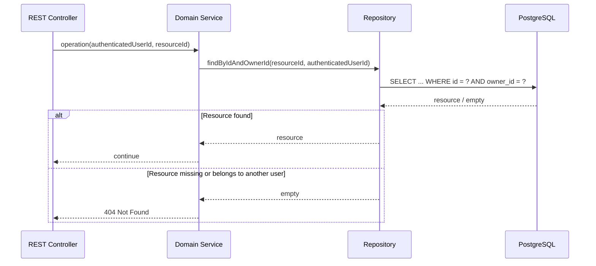

## אבטחה

בכוונה מוחזר `404` גם כאשר המשאב קיים אך שייך למשתמש אחר.

כך לא חושפים את עצם קיומו של המשאב.

---

# 11. Global Error Handling

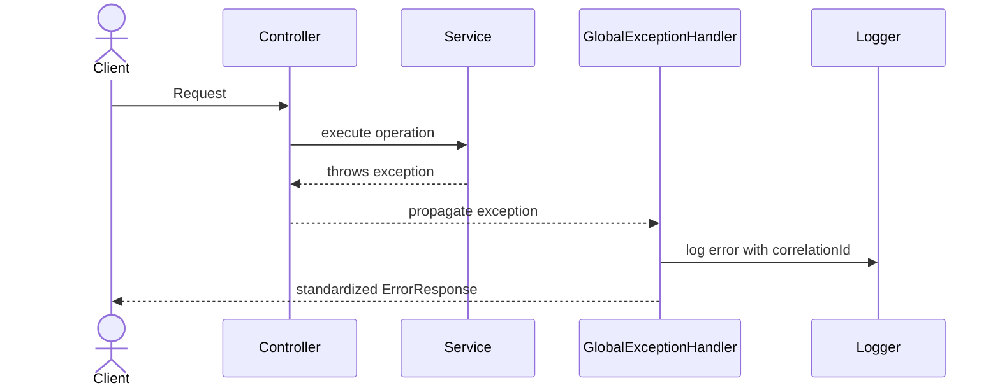

## Error Response Example

```json
{
  "timestamp": "2026-07-24T15:30:00Z",
  "status": 409,
  "code": "SIGNAL_ALREADY_EXECUTED",
  "message": "The signal has already been executed.",
  "correlationId": "8f44e0c2-6bdf-4b10-b0f7-4e43b2a5b138"
}
```

---

# 12. Angular HTTP Error Flow

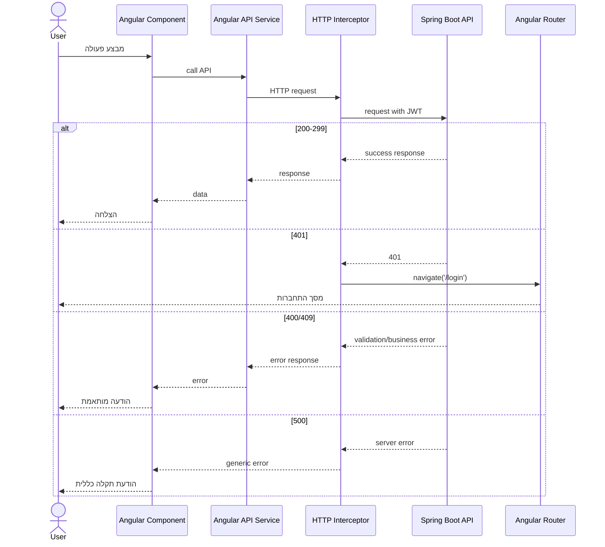

---

# כללי יישום כלליים

- Controllers דקים.
- Business Logic ב-Service בלבד.
- גישה למסד דרך Repository בלבד.
- Mapping דרך MapStruct.
- פעולות כתיבה מורכבות בתוך Transaction.
- Ownership נבדק בכל משאב פרטי.
- Response Errors אחידים.
- Correlation ID עובר בכל הבקשה.
- Preview אינו כותב למסד.
- Execute חייב להיות Idempotent ברמת Signal.

---

# Checklist למימוש

## Register

- [ ] אימייל מנורמל
- [ ] בדיקת כפילות
- [ ] BCrypt
- [ ] תגובת 201
- [ ] בדיקת Integration

## Login

- [ ] הודעת שגיאה אחידה
- [ ] JWT תקין
- [ ] Expiration
- [ ] בדיקת Token פגום

## Portfolio Creation

- [ ] בדיוק 10 מניות
- [ ] Symbols ייחודיים
- [ ] סכום משקלים 100%
- [ ] Transaction מלאה
- [ ] BigDecimal בלבד

## Rebalance

- [ ] Preview ללא כתיבה
- [ ] Execute עם נעילה
- [ ] מניעת Execute כפול
- [ ] Snapshot לפני ואחרי
- [ ] Rollback מלא בכשל

## Security

- [ ] Ownership בכל Resource
- [ ] 404 למשאב שאינו שייך למשתמש
- [ ] אין מידע רגיש בלוגים
- [ ] JWT Filter לכל Endpoint מוגן

---

# הצעד הבא

`14_CLASS_DIAGRAM.md`

המסמך הבא יגדיר:

- Entities
- Repositories
- Services
- Controllers
- DTOs
- יחסי תלות
- גבולות אחריות בין שכבות
- תרשים UML מלא ב-Mermaid
