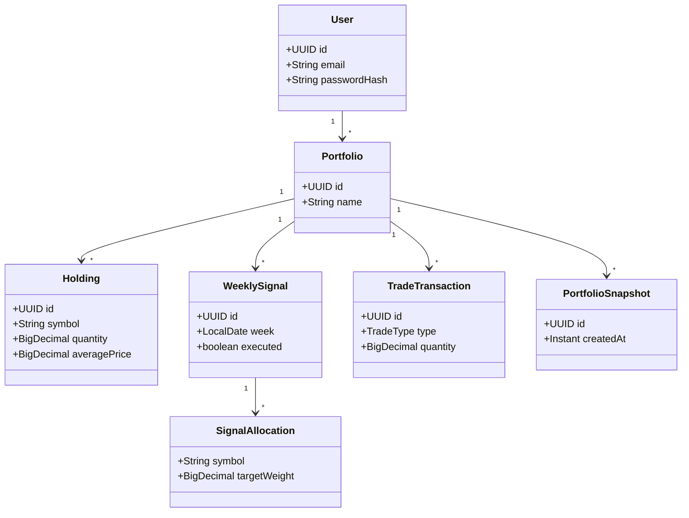

# 14_CLASS_DIAGRAM.md

# ShareCutter - Class Diagram

## מטרת המסמך

להגדיר את מבנה המחלקות המרכזיות במערכת, תחומי האחריות שלהן והתלויות ביניהן.

---

# שכבות המערכת

```text
Angular
    │
REST Controllers
    │
Services
    │
Repositories
    │
PostgreSQL
```

---

# UML (Mermaid)



---

# Controllers

- AuthController
- UserController
- PortfolioController
- SignalController
- RebalanceController
- DashboardController

אחריות:
- קבלת HTTP Requests
- החזרת Responses
- ללא Business Logic

---

# Services

- AuthService
- UserService
- PortfolioService
- SignalService
- RebalanceService
- DashboardService
- SnapshotService

אחריות:
- כל הלוגיקה העסקית
- Transactions
- Validation עסקי

---

# Repositories

- UserRepository
- PortfolioRepository
- HoldingRepository
- WeeklySignalRepository
- TradeTransactionRepository
- SnapshotRepository

אחריות:
- גישה למסד בלבד

---

# DTOs

Request:
- RegisterRequest
- LoginRequest
- CreatePortfolioRequest
- CreateSignalRequest

Response:
- UserResponse
- LoginResponse
- PortfolioResponse
- DashboardResponse
- ErrorResponse

---

# Utilities

- JwtService
- AllocationCalculator
- RebalanceCalculator
- MapStruct Mappers

---

# Dependency Rules

- Controller → Service בלבד
- Service → Repository בלבד
- Repository → Database בלבד
- Entity אינה מכירה Controller
- DTO אינו Entity

---

# Clean Architecture Rules

- אחריות אחת לכל מחלקה.
- אין לוגיקה עסקית ב-Controller.
- אין SQL מחוץ ל-Repository.
- אין Entity ב-API.

---

# Checklist

- [ ] Controllers דקים
- [ ] Services ללא UI
- [ ] Repository ללא Business Logic
- [ ] DTO לכל Endpoint
- [ ] MapStruct לכל Mapping

---

# הצעד הבא

15_ER_DIAGRAM.md
