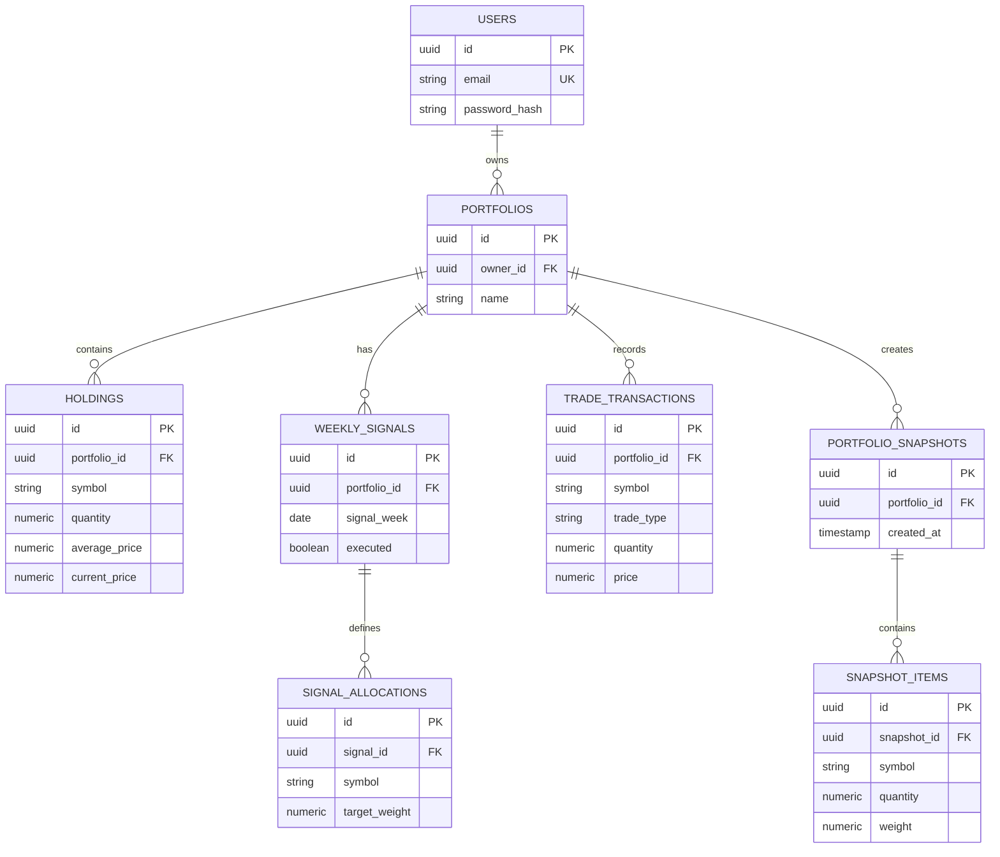

# 15_ER_DIAGRAM.md

# ShareCutter - Entity Relationship Diagram

## מטרת המסמך

להציג את מבנה מסד הנתונים בצורה ויזואלית ואת הקשרים בין הישויות.

---

# ER Diagram (Mermaid)

---

# Cardinality

- User → Portfolios : 1:N
- Portfolio → Holdings : 1:N
- Portfolio → Weekly Signals : 1:N
- Weekly Signal → Signal Allocations : 1:N
- Portfolio → Trade Transactions : 1:N
- Portfolio → Snapshots : 1:N
- Snapshot → Snapshot Items : 1:N

---

# Index Strategy

## Users

- email UNIQUE

## Portfolios

- owner_id
- owner_id + name

## Holdings

- portfolio_id
- portfolio_id + symbol UNIQUE

## Weekly Signals

- portfolio_id
- signal_week

## Transactions

- portfolio_id
- created_at

## Snapshots

- portfolio_id
- created_at

---

# Integrity Rules

- Foreign Keys בכל הקשרים.
- ON DELETE RESTRICT כברירת מחדל.
- ON DELETE CASCADE רק כאשר מחיקת הורה מחייבת מחיקת ילדים.
- UUID לכל הטבלאות.

---

# Business Rules

- לכל תיק בדיוק 10 אחזקות פעילות.
- סימבול ייחודי בתוך תיק.
- משקלי איתות חייבים להסתכם ל-100%.
- Execute מתבצע פעם אחת בלבד לכל Signal.

---

# Checklist

- [ ] כל FK מוגדר
- [ ] אינדקסים קיימים
- [ ] UUID בכל הישויות
- [ ] Numeric לכל ערך כספי
- [ ] Constraints מוגדרים

---

# הצעד הבא

16_DEPLOYMENT_GUIDE.md
